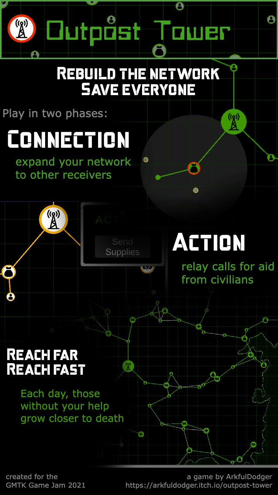

  

# Outpost Tower

A strategic puzzle and resource-management game.

In the wake of a catastrophe, all communications are down. Outpost Tower stands as the only link between the people of this battered region, the only way they might be saved.

Part puzzle, part strategy, you must incrementally rebuild a communication network across a map. Connect medical and supply posts with the civilians who will perish without their aid. Quickly and carefully plot and reconfigure the pieces on the map to ensure everyone survives to the end.

Your Goal: completely reconnect all the map's nodes on one active network... before anybody dies!

# About

Developed in 48 hours for the GMTK 2021 Game Jam with the theme: "Joined Together"

[Play on itch.io here.](https://arkfuldodger.itch.io/outpost-tower)

# Features
- When the player connects nodes, connection lines are established, which are styled differently based on whether they are currently active or not
- Player resources shift and recalculate continuously based on resource nodes the player connects to
- Placement and disbursement of resource nodes and civilian nodes is randomized for each game
- Civilians nodes further away from the player's starting point have resources to survive longer than those closer so the player has time to reach them

# Credits

**Music:**
Art of silence by uniq
https://soundcloud.com/uniqofficial
Attribution 4.0 International (CC BY 4.0)
https://creativecommons.org/licenses/by/4.0
Music promoted by https://www.chosic.com 

**SFX:**
http://www.littlerobotsoundfactory.com/
https://paularthurmusic.com/

**Icons:** 
Freepik, Pixel Perfect, mavadee
